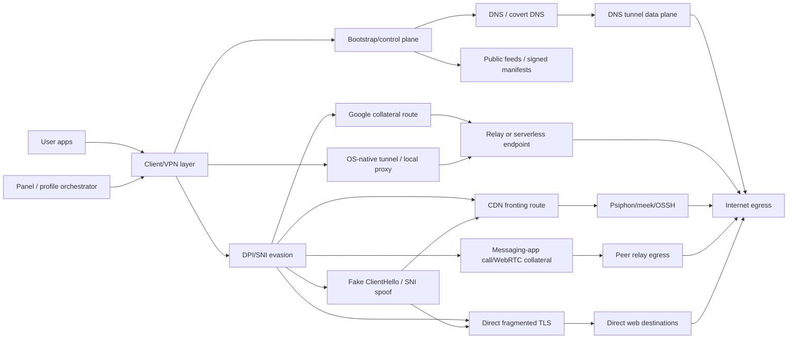

# Architecture Map

The bigger picture is a set of interchangeable components. The same client can mix and rotate them.

## Useful Distinctions

### Control Plane Vs Data Plane

DNS can be excellent for control or bootstrap, but that does not mean DNS is the best full data plane. A stable system may use DNS to discover the current transport rather than trying to carry all traffic over DNS.

### Reachability Vs Usability

Scanner output is not enough. A CDN edge may be reachable but fail for the exact tunnel behavior needed: SNI, ALPN, certificate verification, HTTP version, provider routing, or regional policy can all break the path.

### Collateral Value Vs Burn Rate

Google-based paths tend to be harder to block broadly because the collateral damage is high. CDN edge lists can be very effective for a short window, but once the censor sees the pattern, the useful set may collapse quickly.

### Serverless Vs No-Egress

"Serverless" can mean several different things:

- A real relay running on managed infrastructure, such as Apps Script or Workers.
- No private VPS, but still using a provider as the apparent route.
- No relay at all, just local DPI evasion for direct destinations.

These should be tracked separately because they fail differently.

### Transport Vs Product Surface

MoaV, Hiddify, 3x-ui, BPB, Throne, WhiteDNS, Cloak, and VibeCodeGit-style apps are not just transports. They are packaging and orchestration layers. Track whether a route works separately from whether generated users, subscriptions, app UI, DNS behavior, and lifecycle cleanup are correct.

## Stability Heuristic

Most stable to least stable, based on current evidence:

1. Provider-collateral routes with high blocking cost and behavior close to normal clients.
2. DNS or other resilient bootstrap/control methods paired with a stronger transport.
3. Mature tunnel ecosystems with rotating infrastructure, such as Psiphon-style clients.
4. Native clients that can rotate between known method families without exposing raw configs.
5. Peer-assisted messaging-app collateral routes, when call infrastructure remains reachable and metadata risk is acceptable.
6. CDN edge/SNI recipes that depend on small discovered working sets.
7. Single config drops that depend on one packet quirk or one public paste.
