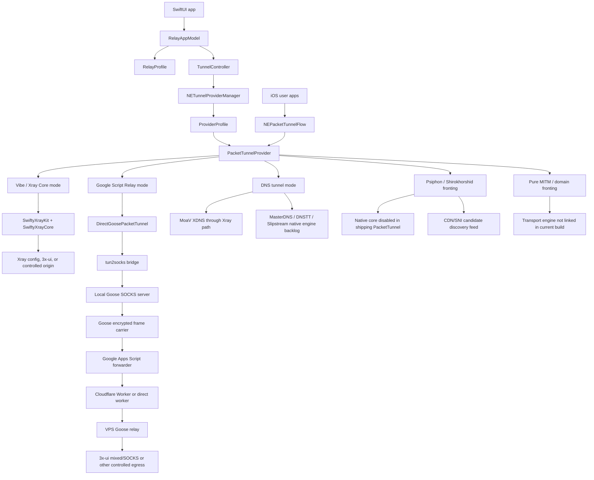

# VibeCodeGit VPN 2.0 Architecture And Codebase

Last reviewed: 2026-05-28

Credits first: the architecture relies on [SwiftyXrayKit](https://github.com/dima-u/SwiftyXrayKit), [SwiftyXrayCore](https://github.com/dima-u/SwiftyXrayCore), [XTLS/Xray-core](https://github.com/XTLS/Xray-core), [GooseRelayVPN](https://github.com/Kianmhz/GooseRelayVPN), [MasterDnsVPN](https://github.com/masterking32/MasterDnsVPN), [dnstt](https://github.com/patterniha/dnstt), [slipstream](https://github.com/patterniha/slipstream), [Shir-o-Khorshid/Psiphon](https://github.com/shirokhorshid/psiphon-tunnel-core), [3x-ui](https://github.com/MHSanaei/3x-ui), [MoaV](https://github.com/shayanb/MoaV), Cloudflare Workers, Google Apps Script, and Apple NetworkExtension. We applaud them before describing our own glue.

## System Diagram

## Runtime Flows

### Vibe / Xray Core

The app accepts a VLESS/VMess/Trojan/Shadowsocks/SOCKS share link or raw Xray JSON. `TunnelController` validates the input, installs the provider configuration, and the PacketTunnel starts SwiftyXrayKit. Xray owns the proxy behavior while tun2socks connects device packets to the local core.

### Google Script Relay

The PacketTunnel starts a local Goose SOCKS server and a packet bridge. Device packets go through tun2socks into Goose, Goose encrypts and batches frames locally, and Apps Script or a Worker forwards opaque payloads to a controlled exit. Apps Script should never hold tunnel keys or see plaintext target hosts.

### DNS Tunnel

The app has a DNS tab for MoaV XDNS, MasterDNS, DNSTT, and Slipstream. MoaV XDNS can be treated as an Xray-config path. MasterDNS, DNSTT, and Slipstream are tracked as native-engine backlog items until they are linked into the PacketTunnel memory and entitlement model.

### Psiphon / Fronting

The UI can hold Psiphon/Shir-o-Khorshid configuration, but the active PacketTunnel class currently blocks this path. The public-safe architecture lesson is still valuable: scan and candidate selection should be a low-volume feed into the fronting dialer, not a high-noise transport button.

## Codebase Map

| Area | Files | Role |
| --- | --- | --- |
| App entry and UI | `VibeCodeGits_VPN_2_0App.swift`, `ContentView.swift` | SwiftUI shell, transport tabs, setup panels, status, and diagnostics. |
| App state | `RelayProfile.swift`, `RelayAppModel.swift` | User-facing profile model, transport selection, stage tests, metrics, health checks, and normalization. |
| VPN lifecycle | `TunnelController.swift` | `NETunnelProviderManager` loading, validation, install/start/stop/reset, provider messages, and preference timeouts. |
| Provider profile boundary | `PacketTunnel/ProviderProfile.swift` | Converts provider configuration into PacketTunnel-readable mode, DNS, Xray, Psiphon, relay, and MTU fields. |
| PacketTunnel router | `PacketTunnel/PacketTunnelProvider.swift` | Applies network settings, starts selected mode, handles provider messages, gathers metrics, and stops active tunnels. |
| Apps Script / Goose path | `PacketTunnel/GooseRelay.swift` | Local SOCKS server, tun2socks packet bridge, fake DNS mapping, Goose frame crypto, carrier workers, self-tests, and metrics. |
| DNS path | `PacketTunnel/DNSRelay.swift`, `PacketTunnel/DNSRelayNative.swift`, `MasterDNSBackupClient.swift` | Current stub plus backup/native bridge work for MasterDNS-style local SOCKS transport. |
| Psiphon path | `PacketTunnel/PsiphonRelay.swift`, `PacketTunnel/Experimental/` | Shipping stub plus disabled native experiment. |
| Relay templates | `RelayScripts/`, `CloudflareWorker/src/worker.js` | Apps Script and Cloudflare Worker forwarding templates. |
| Provisioning helper | `Provisioning/3xui-add-mixed-inbound.mjs` | Creates a 3x-ui mixed inbound and emits a client config when run with env-provided credentials. |
| Rust prototype | `RustCore/`, `PacketTunnelTemplate/` | Relay-core FFI prototype and packet-flow template retained for future native core work. |
| Third-party static libraries | `ThirdParty/` | Local static-library integrations for DNS and Psiphon experiments. |

## Codebase Guardrails

- Do not publish generated runtime material from `Provisioning/generated/`.
- Do not publish app build products, TestFlight archives, provisioning profiles, or local Xcode user data.
- Treat default URLs, deployment IDs, auth values, tunnel keys, and resolver pools as private runtime configuration even when they appear in local notes.
- Keep PacketTunnel logs capped and redacted. Packet summaries are useful for debugging, but hostnames, generated keys, and active endpoints must not become public artifacts.
- Preserve the distinction between selected tab and connected transport. Viewing a configuration is not the same as activating it.
- Keep the PacketTunnel memory budget in mind before embedding Go-based native engines; prefer Swift or Rust FFI for long-running iOS tunnel code unless a proof-of-life requires otherwise.

## Verification Notes

Local implementation notes record successful simulator and unsigned generic-device builds. This KB update did not republish the app source or rerun the iOS build; it documents the architecture and codebase boundaries for public review.
